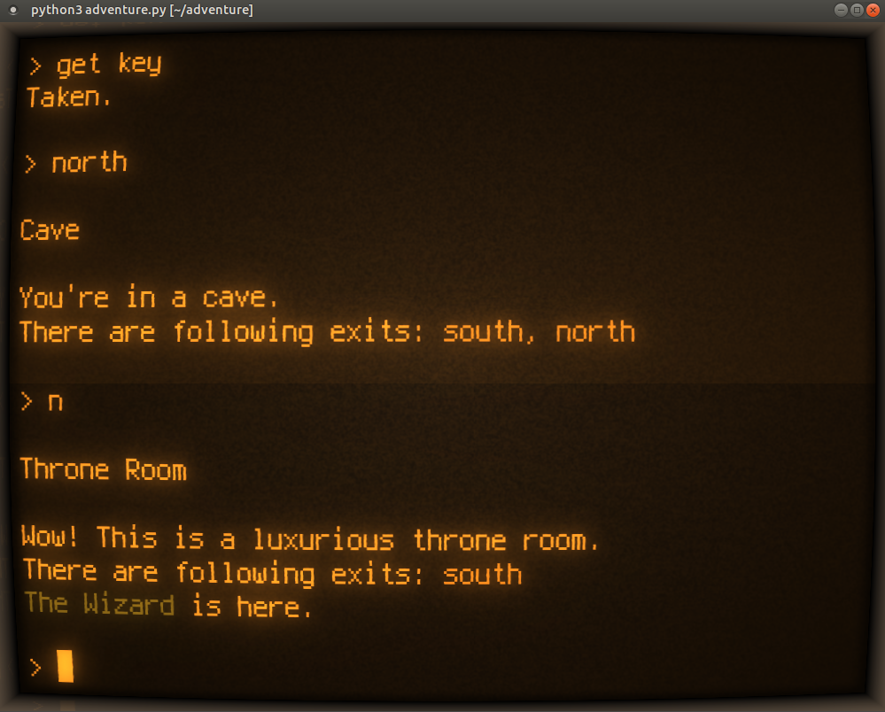

# User stories

<!-- toc -->

- [Basic program](#basic-program)
- [Movement](#movement)
- [Colors](#colors)
- [Items](#items)
- [Help](#help)
- [Bigger game scenario](#bigger-game-scenario)
- [Keys and opening doors](#keys-and-opening-doors)
- [Characters](#characters)
- [Characters move between rooms](#characters-move-between-rooms)
- [Keeping score](#keeping-score)
- [Winning the game](#winning-the-game)

<!-- tocstop -->

First, a screenshot for inspiration:



(want a cool terminal? install `cool-retro-term`)

## Basic program

*This should already be in your starting code*.

I should be able to run the game, see my surroundings, and quit.

- Display information about surroundings
- Ask for a command
- The command `quit`, or `q` should exit
- The command `look`, or `l` should describe the room again

<details>
<summary>Example</summary>

```
Outside

You're standing outside a large cave.

> xxx
I don't recognize that command.

> quit
Goodbye!
```

</details>

## Movement

I want to move between rooms.

- There are at least 2 rooms, connected by exits
- Commands: `north`, `south`, `east`, `west` (or `n`, `s`, `e`, `w`) move between rooms
- Display which exits are available (e.g. `north`, `south`)
- Display room information when moving

Hint: Store a dictionary of exits in a room: `'east': 'room1', 'west': 'room2'` etc.

<details>
<summary>Example</summary>

```
Outside

You're standing outside a large cave.
There are the following exits: north

> north

Cave

You're inside a huge cave.
There are the following exits: south
```

</details>

## Colors

I want to see information visually highlighted, so that it's easier to notice important details.

For example, you can use different colors for:
- Room title
- Exits (north, south etc.)
- Items
- Characters
- Prompt (the beginning `"> "`)

In Python, you can use the [termcolor](https://pypi.org/project/termcolor/) library.

## Items

I want to find items, and pick them up.

- There are some items in rooms
- Items are described when room is described
- The command `get` should pick the item up -- now the player has it
- The command `inventory` (or `i`) should display player's list of items

Hint: You can either have a separate prompt for the item (`"Get what? "`), or expect a more complicated command in single line (`get lamp`).

<details>
<summary>Example</summary>

```
Outside

You're standing outside a large cave.
There are items on the floor: key

> get
Get what? key
Taken.

> i
You are carrying: key
```

</details>

## Help

I want to see a list of commands, so that I know what's possible in the game.

- The command `help` (or `h`, or `?`) should display a list of available commands
- Remember to add new commands to help after you implement them!
- The game starts with `Type "help" for a list of commands.`

## Bigger game scenario

I want to play an interesting game with a lot of space to explore!

- There are at least 5 rooms with various names and descriptions
- You have a map (on paper) of rooms and connections

## Keys and opening doors

I want to be forced to find a key before I can go further.

- There is an item (key) that you can pick up, or receive from a character
- Some exits can be taken only when you have the key

## Characters

I want to meet some non-player characters!

- There is a Wizard in one of the rooms. Describe him when the room is described
- The command `talk` causes him to say something

<details>
<summary>Example</summary>

```
Cave

You're in a cave.
The Wizard is here.

> talk
Talk to who? The Wizard
The Wizard says, "Greetings, adventurer!"
```

</details>

## Characters move between rooms

I want to see more interesting behaviour from the characters.

- Every few turns, the characters should move randomly to the next possible room
- If the character is in the room, there is a message like `The Wizard enters from the north` or `The Wizard exits to the east`

## Keeping score

I want the game to keep a score, so that I know how awesome I am.

- Player starts at 0 points
- Visiting each room is worth some number of points (dependent on the room)
- Same with talking to a character, or picking up an item
- The game displays the score when you quit (or win)

## Winning the game

I want to be able to win the game.

- There is a goal to the game (like reaching some room)
- The goal is not trivial to achieve (for instance, requires unlocking something)
- The game displays the goal at the beginning
- When I reach the goal, the game displays congratulations and maybe some nice ASCII art, then exits
